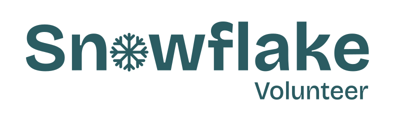
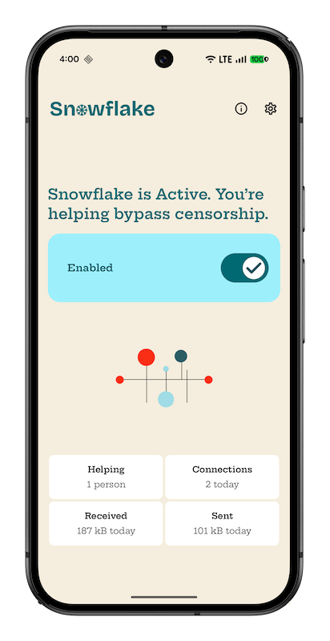
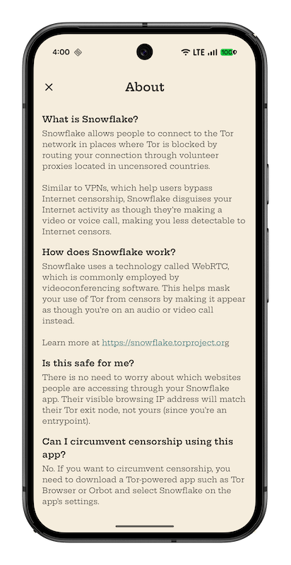
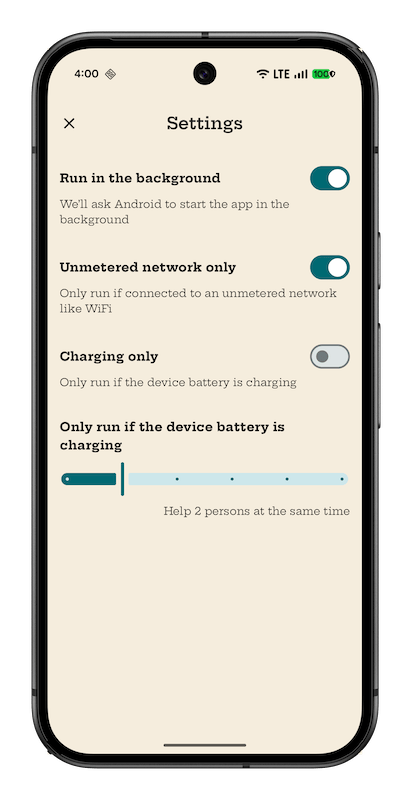

# 

Android app for [Tor Snowflake](https://snowflake.torproject.org) volunteers.

**Help people in censored countries access the Internet without restrictions.**

## Screenshots

## What’s Snowflake?

Snowflake allows people to connect to the Tor network in places where Tor is blocked by routing
your connection through volunteer proxies located in uncensored countries.

Similar to VPNs, which help users bypass Internet censorship, Snowflake disguises your Internet
activity as though you’re making a video or voice call, making you less detectable to Internet
censors.

